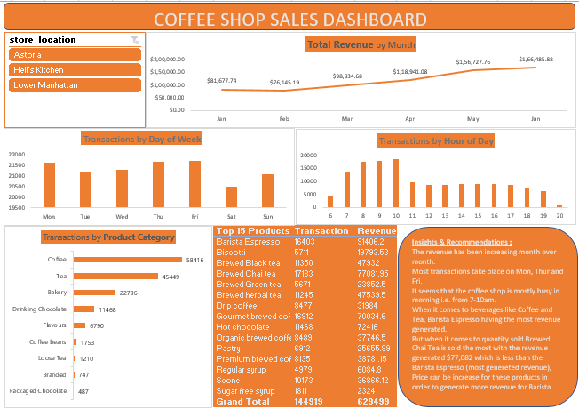

# Coffee-Shop-Sales-Customer-Insights-Dashboard
# ☕ Coffee Shop Sales Dashboard

## 📌 Project Overview

A coffee shop with three store locations in New York City provided transaction data from **January to June 2023**. As a Data Analyst, the objective was to **analyze customer purchase behavior** and build an **interactive Excel dashboard** to help the business identify **sales trends**, **customer patterns**, and **growth opportunities**.

---

## 🔍 Step 1: Data Preparation

- Opened and reviewed the dataset:
  - Checked the number of records.
  - Verified the minimum and maximum transaction dates.
  - Identified types of products sold.

- Added new columns using Excel formulas for better analysis:
  - `Revenue = Price × Quantity`
  - `Month Name = TEXT(Date, "mmm")`
  - `Weekday = TEXT(Date, "ddd")`
  - `Hour of Transaction = HOUR(Time)`

---

## 📊 Step 2: Data Exploration Using Pivot Tables

Created pivot tables to analyze:

- **Monthly Revenue Trends**
- **Number of Transactions** by:
  - Day of the Week
  - Hour of the Day
  - Product Category
- **Revenue and Quantity Sold** by Product Type

---

## 📈 Step 3: Dashboard Creation

- Built interactive charts and visuals in Excel.
- Added **Slicers** to filter data dynamically based on:
  - Store Location
---

## ✨ Key Insights & Recommendations

- 📈 **Monthly revenue** shows consistent growth from Jan to Jun 2023.
- 📅 **Most transactions** occur on **Monday**, **Thursday**, and **Friday**.
- ⏰ **Peak hours**: 7:00 AM – 10:00 AM, indicating strong morning traffic.
- ☕ **Barista Espresso** generated the **highest revenue**.
- 🍵 **Brewed Chai Tea** sold in the highest quantity, generating **$77,082** in revenue.
- 💡 **Recommendation**: Consider increasing the price of popular products like **Barista Chai Tea** and **Gourmet Brewed Coffee** to boost overall revenue.

---

## 📊 Dashboard Preview

---
